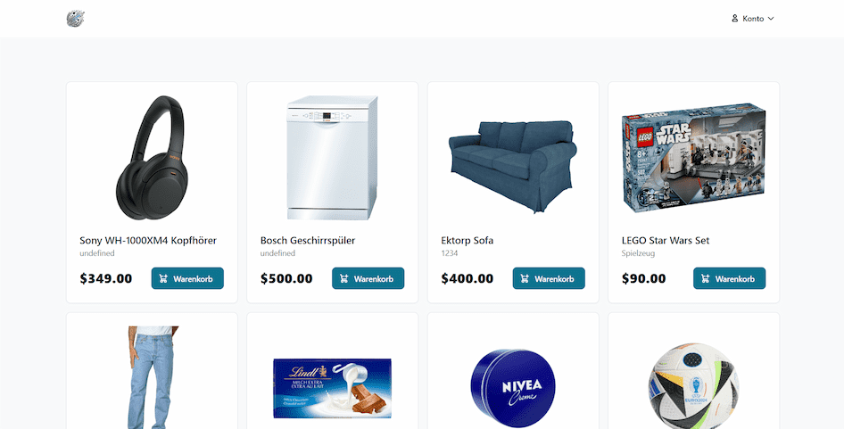

# 👋 Hi there, I'm Noah

Welcome to my GitHub profile! I'm a **second-year application development student** based in Bern, Switzerland. I have a strong interest in learning about software development and cybersecurity. Although I’m just starting out, I love exploring new technologies and taking on new challenges to expand my knowledge.

### 📍 Location: Bern, Switzerland

---

## 🚀 Projects

Here are some of the projects I’ve been working on. They reflect my curiosity, my willingness to learn, and my current skill set. Each one has helped me gain more experience and a deeper understanding of development.

### 🌐 [Online Shop](https://github.com/A5TUT0/OnlineShop)

**Description:** This project is an online store where users can manage categories and products. I developed this using HTML, CSS, and JavaScript for the frontend, and an API with Express.js for the backend. It was a great way to learn about user authentication, building a basic API, and frontend design using Tailwind CSS.

**Tech Stack:** Tailwind, HTML, JavaScript, Figma

### 🎮 [Minekraft](https://github.com/A5TUT0/Minecraft3D)

**Description:** A fun project where I recreated the game Minecraft using Three.js. It’s still a work in progress, but I’m excited about learning 3D rendering and game mechanics with this project. It’s my way of combining my love for gaming and coding.

**Tech Stack:** React, Three.js, JavaScript, Vite

### 🍴 [Recipe App](https://github.com/A5TUT0/Rezepte)

**Description:** A desktop app to manage recipes, developed in Java using NetBeans. It allowed me to work on database management with SQLite and implement features like adding, editing, and searching recipes. Working on this project taught me a lot about desktop application development and accessibility principles.

**Tech Stack:** Java, Figma, NetBeans, SQLite

---

## 📚 Education

### 📅 Summer 2023 - Present | Software Developer Intern at [CsBe](https://csbe.ch)

- Developed basic web applications using HTML, CSS, and JavaScript.
- Worked in a team environment and learned about agile development practices.

---

## 🛠️ Skills

I’m still learning, but here are some of the technologies I’ve had the chance to work with:

- **Frontend Development**: HTML, CSS, JavaScript, React, Tailwind
- **Backend Development**: Express, SQLite
- **Software Development**: Java, NetBeans
- **Cybersecurity**: Basic Ethical Hacking, Python for Penetration Testing

---

## 📫 Contact

I’m always open to learning new things and collaborating on projects. If you’d like to get in touch, here’s how you can reach me:

- **Email**: [contact@noahlezama.com](mailto:contact@noahlezama.com)
- **Website**: [noahlezama.com](https://noahlezama.com)
- **GitHub**: [A5TUT0](https://github.com/A5TUT0)

---

**Thanks for stopping by!** Feel free to check out my projects, leave a star, or just drop me a message.
